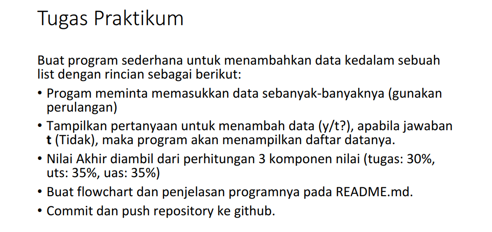
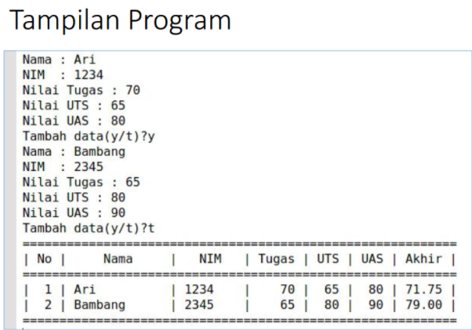
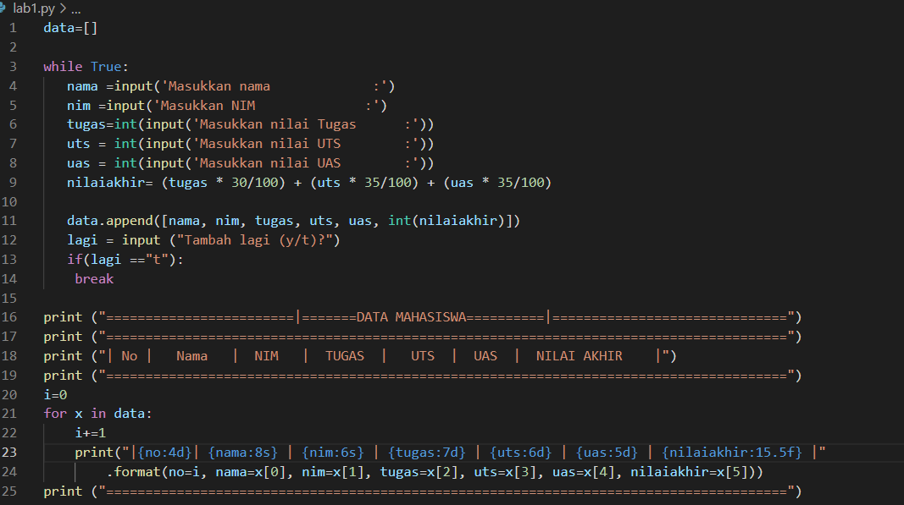
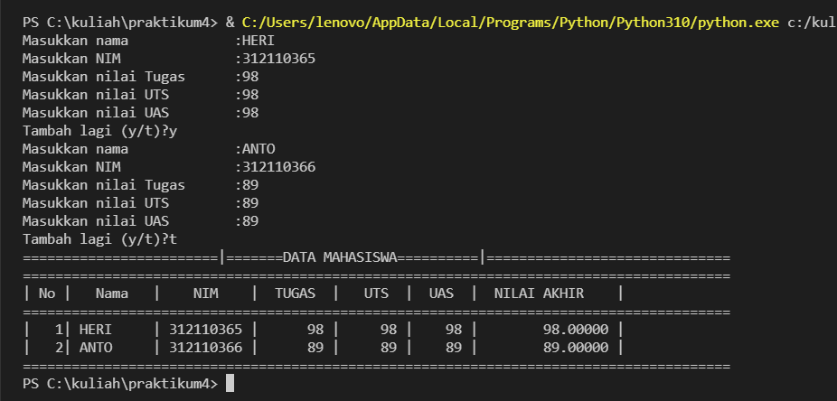

# PRAKTIKUM 4 - PERTEMUAN 9
## LATIHAN

Berikut ini adalah tugas  dari Latihan, bisa dilihat pada gambar berikut:

### PENJELASAN

Berikut ini source code dari tugas Latihan

Berikut hasil (output)dari souce code tugas Latihan

## LAB1

Berikut ini adalah tugas dari Pertemuan 9, bisa dilihat pada gambar berikut:

dan berikut ini hasil yang diharapkan setelah program berjalan :

### PENJELASAN 

Berikut source code dari program sederhana Data Nilai Mahasiswa

Didalam source code atau soal tersebut menunjukkan bahwa sistem harus menampilkan data sebanyak-banyaknya jika pengguna menginputkan Y pada pilihan Tambah Lagi ? . Sedangkan hasilnya juga harus sama, menampilkan data sebanyak yang diinputkan pengguna. Dan harus terbentuk dalam Tabel.

Berikut hasil setelah saya menginputkan 2 Data Nila Mahasiswa:

- Pertama kita membuat variable list kosong. data = [] ulang = True

Variable ulang = True digunakan untuk mengontrol perulangan

- Lalu kita membuat kondisi perulangan dan statement yang akan dijalankan ketika perulangan terjadi

while True: nama = input("Masukkan Nama: ") nim = input("Masukkan NIM: ") tugas = int(input("Masukkan Nilai Tugas: ")) uts = int(input("Masukkan Nilai UTS: ")) uas = int(input("Masukkan Nilai UTS: ")) nilaiakhir = (tugas * 30/100) + (uts * 35/100) + (uas * 35/100)

data.append([nama, nim, tugas, uts, uas, int(akhir)])

Dari statement diatas, kita akan diminta untuk menginput nama, nim, nilai tugas, nilai uts, dan nilai uas,lalu system akan menjumlahkan nilai-nilai tersebut dan menghasilkan nilai akhir. Setelah menginput berbagai data atau item, inputan item tersebut akan masuk ke dalam list 'nilai'

- Setelah membuat perulangan, kita membuat statement untuk menghentikan atau keluar dari perulangan yang terjadi.

 lagi = input ("Tambah lagi (y/t)?")

   if(lagi =="t"):

    break

Untuk keluar dari perulangan kita hanya perlu menginputkan t apabila diminta pada saat program dijalankan.t akan membuat variable True menjadi lagi = break yang mana akan menghentikan perulangan yang terjadi.

- Terakhir kita akan mencetak hasil dari program yang telah dibuat.

print ("========================|=======DATA MAHASISWA==========|==============================")

print ("=======================================================================================")

print ("| No |	 Nama 	|    NIM    |  TUGAS  |   UTS  |  UAS  |  NILAI AKHIR    |")

print ("=======================================================================================")

i=0

for x in data:

	i+=1 

	print("|{no:4d}| {nama:8s} | {nim:7s} | {tugas:7d} | {uts:6d} | {uas:5d} | {nilaiakhir:15.5f} |"

		.format(no=i, nama=x[0], nim=x[1], tugas=x[2], uts=x[3], uas=x[4], nilaiakhir=x[5]))

print ("=======================================================================================")

