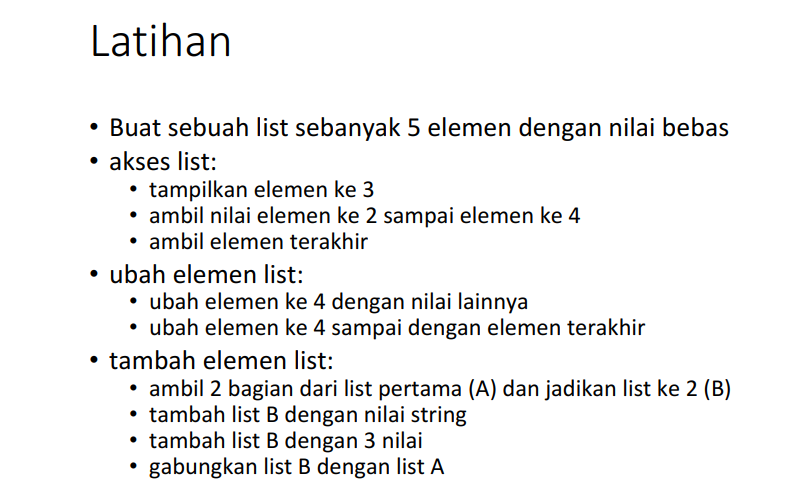
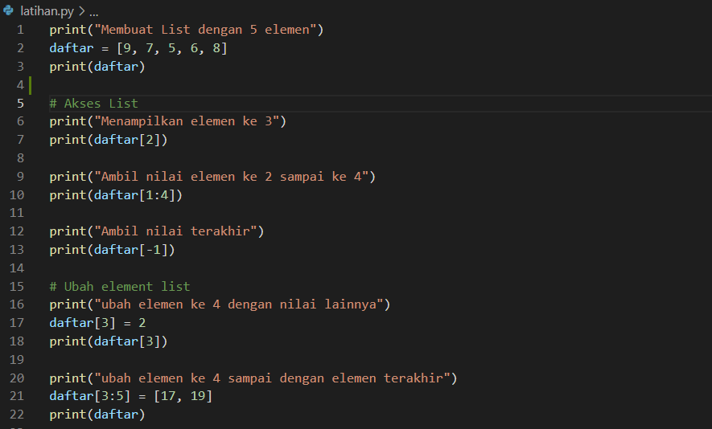
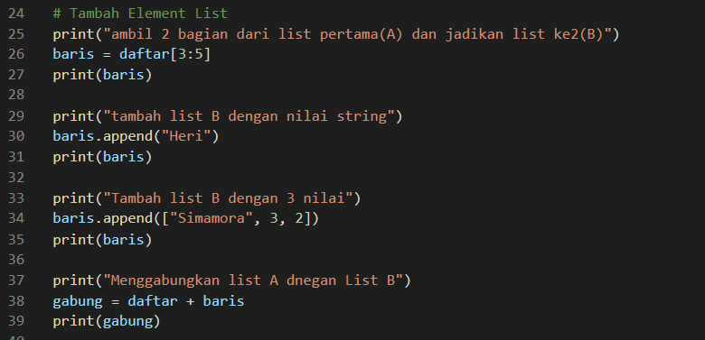
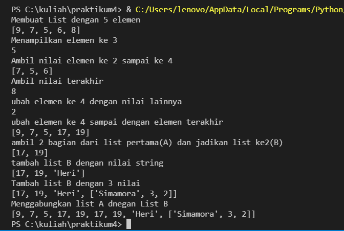

# PRAKTIKUM 4 - PERTEMUAN 9
## LATIHAN

Berikut ini adalah tugas  dari Latihan, bisa dilihat pada gambar berikut:

### PENJELASAN

Berikut ini source code dari tugas Latihan

Berikut hasil (output)dari souce code tugas Latihan

